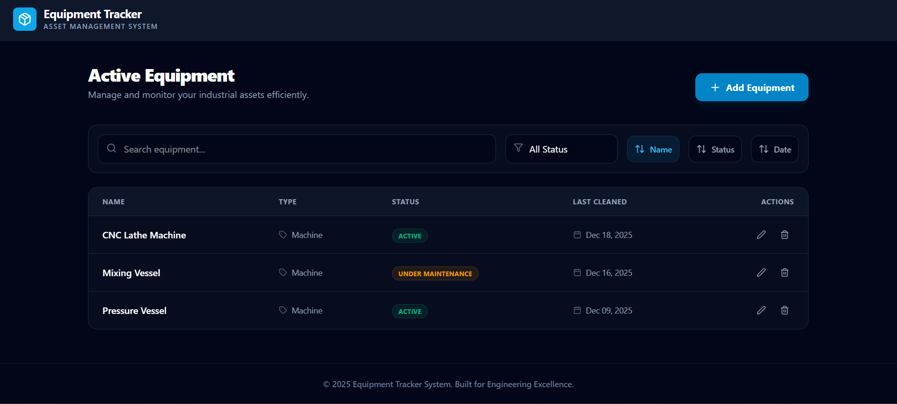

<p align="center">
  
  
  
  
</p>
<p align="center">
  
  
  
</p>  

<p align="center">
Equipment Tracker is a modern, high-performance web application designed for industrial asset management. Built with the full MERN stack, it allows organizations to monitor equipment status, track cleaning schedules, and manage inventory with a premium, user-centric interface.
</p>  

---

## ✨ Overview  

**Equipment Tracker** provides a seamless experience for managing industrial machinery. The application features a sleek, glassmorphic UI, real-time filtering, and full CRUD capabilities, ensuring that your equipment data is always accurate and accessible.
 



---

## 🎯 Key Features  

* **Equipment Management**: Effortlessly Add, View, Edit, and Delete equipment records.
* **Smart Filtering & Search**: Instantly find equipment by name or type, and filter by status (Active, Inactive, Under Maintenance).
* **Multi-Column Sorting**: Organize your equipment list by Name, Status, or Last Cleaned Date with a single click.
* **Premium Dashboard UI**: A modern, dark-themed interface built with Tailwind CSS and enhanced with smooth micro-animations.
* **Validation & Error Handling**: Robust form validation ensures data integrity, while comprehensive error handling provides a smooth user experience.
* **Responsive Design**: Optimized for desktops, tablets, and smartphones.
* **MVC Backend Architecture**: Cleanly organized Node.js/Express backend following the Model-View-Controller pattern.

---

## 🛠️ Tech Stack  

This project is built with the following technologies:

| Client (Frontend)  | Server (Backend) | Database    |
| ------------------ | ---------------- | ----------- |
| React.js (Vite)    | Node.js          | MongoDB Atlas|
| Tailwind CSS       | Express.js       | Mongoose    |
| Lucide React (Icons)| Cors             |             |
| Axios              | Dotenv           |             |
| Date-fns           | Nodemon          |             |


## ⚙️ Local Setup  

To run this project locally:  

1. **Clone the repository**  
   ```bash
   git clone <your-repo-url>
   cd Equipment-tracker
   ```

2. **Setup the Database**
   - Create a `.env` file in the `server` directory.
   - Add your MongoDB Atlas connection string:
   ```env
   MONGODB_URI=your_mongodb_connection_string
   PORT=5000
   ```

3. **Install Dependencies (Root)**
    ```bash
    npm install
    ```

4. **Start the Development Server**
    ```bash   
    npm run dev 
    ```
This command will start both the **Frontend (Vite)** and the **Backend (Express)** simultaneously using `npm-run-all`.

---

<p align="center"> Developed by <b>Punith Raj K</b> </p>
